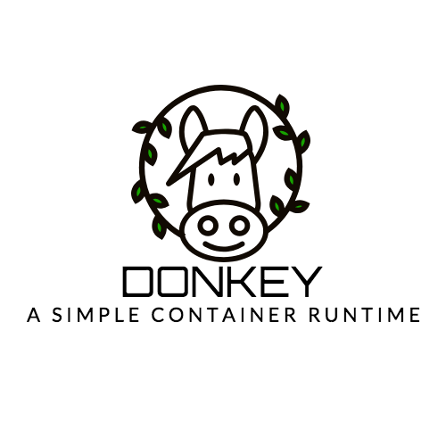

### Donkey

#### 一个简单的用go实现的容器引擎


### 使用环境
- OS: Ubuntu 14.04
- Kernel: 3.13.0-153-generic
- go:1.7


### 运行示例(root)
```bash
# 执行容器终端
donkey run -ti /bin/sh
{"level":"info","msg":"init come on","time":"2018-07-28T18:02:10Z"}
{"level":"info","msg":"command /bin/sh","time":"2018-07-28T18:02:10Z"}
{"level":"info","msg":"command /bin/sh","time":"2018-07-28T18:02:10Z"}
#
# echo "hello"
hello
#ps
  PID TTY          TIME CMD
    1 pts/0    00:00:00 sh
    5 pts/0    00:00:00 ps

# 执行命令
donkey run -ti ls
root@vagrant-ubuntu-trusty-64:/home/vagrant/works/donkey# donkey run -ti /bin/ls
{"level":"info","msg":"init come on","time":"2018-07-28T18:01:48Z"}
{"level":"info","msg":"command /bin/ls","time":"2018-07-28T18:01:48Z"}
{"level":"info","msg":"command /bin/ls","time":"2018-07-28T18:01:48Z"}
container  donkey  main_command.go  main.go  readme.md	run.go

#资源限制
donkey  run -ti -m 100m -cpushare 512 /bin/sh
{"level":"info","msg":"command all is /bin/sh","time":"2018-07-29T15:24:47Z"}
{"level":"info","msg":"init come on","time":"2018-07-29T15:24:47Z"}
{"level":"info","msg":"Find path /bin/sh","time":"2018-07-29T15:24:47Z"}
#

# 运行脚本
root@vagrant-ubuntu-trusty-64:/home/vagrant/works/donkey# donkey  run -ti -m 100m  bash test.sh
{"level":"info","msg":"command all is bash test.sh","time":"2018-07-31T16:08:55Z"}
{"level":"info","msg":"init come on","time":"2018-07-31T16:08:55Z"}
{"level":"info","msg":"Find path /bin/bash","time":"2018-07-31T16:08:55Z"}
stress: info: [4] dispatching hogs: 0 cpu, 0 io, 1 vm, 0 hdd

# 使用镜像 busybox
donkey run -ti sh
{"level":"info","msg":"command all is sh","time":"2018-08-04T10:02:24Z"}
{"level":"info","msg":"init come on","time":"2018-08-04T10:02:24Z"}
{"level":"info","msg":"Current location is /home/vagrant/works/donkey/images/busybox","time":"2018-08-04T10:02:24Z"}
{"level":"info","msg":"Find path /bin/sh","time":"2018-08-04T10:02:24Z"}
/ # busybox
BusyBox v1.29.2 (2018-07-31 20:19:16 UTC) multi-call binary.
BusyBox is copyrighted by many authors between 1998-2015.
Licensed under GPLv2. See source distribution for detailed
copyright notices.
```

### 开发日志
- V2.0
Date: 2018.6.27
单一程序实现简单容器构建,实现Namespace隔离
- V3.0 
Date: 2018.7.28
构建程序大体架构,参考Docker实现命令行构建容器
- V3.1
Date: 2018.7.29
增加CPU,Memory资源限制功能
- V3.2
Date: 2018.8.1
增加运行脚本功能                                                                                              
- V3.2
Date: 2018.8.4
增加Busybox镜像功能

